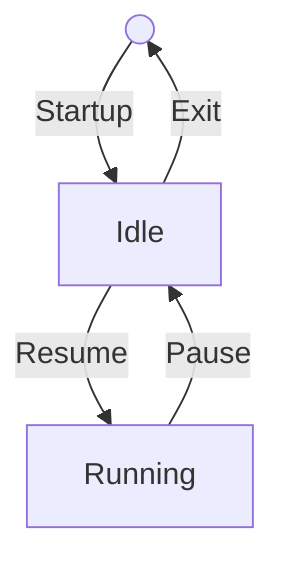
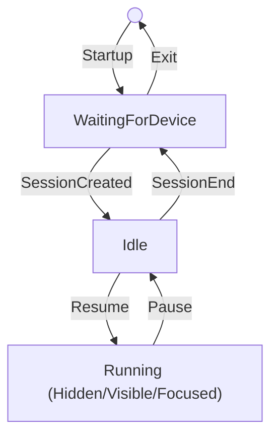

# Lifecycle

## Android

```mermaid
graph
start(( )) -- Startup --> Idle -- Resume --> Running -- Pause --> Idle -- Exit --> start
```

## OpenXR

```mermaid
graph
start(( )) -- Startup --> WaitingForDevice -- SessionCreated --> Idle 
Idle -- Resume --> running["Running (Hidden/Visible/Focused)"] -- Pause --> Idle
Idle -- SessionEnd --> WaitingForDevice -- Exit --> start
```
