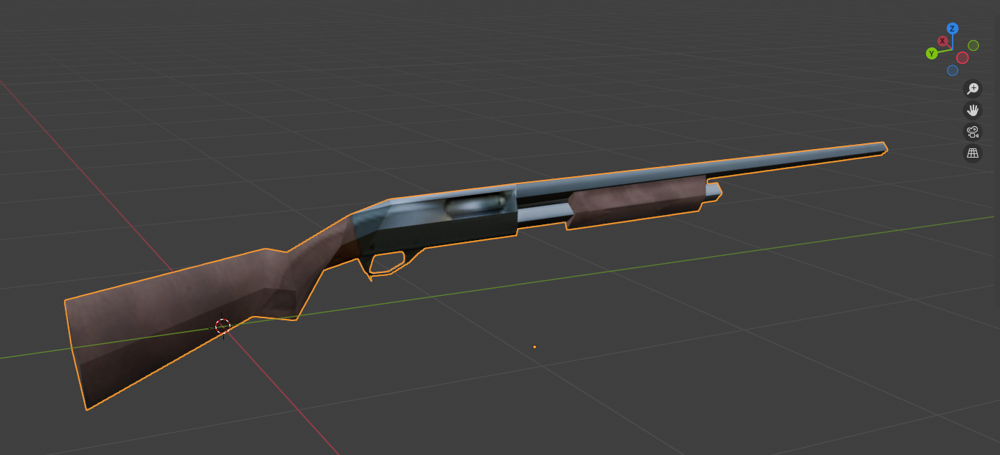

glTF uses the following coordinate system:

- forward: Z
- up: Y
- right: -X

and Bevy uses:

- forward: -Z
- up: Y
- right: X

This means that to correctly import glTFs into Bevy, vertex data should be rotated by 180 degrees around the Y axis.  
For the longest time, Bevy has simply ignored this distinction. That caused issues when working across programs, as most software respects the
glTF coordinate system when importing and exporting glTFs. Your scene might have looked correct in Blender, Maya, TrenchBroom, etc. but everything would be flipped when importing it into Bevy!

Long-term, we'd like to fix our glTF imports to use the correct coordinate system by default.
But changing the import behavior would mean that *all* imported glTFs of *all* users would suddenly look different, breaking their scenes!
Not to mention that any bugs in the conversion code would be incredibly frustating for users.

This is why we are now gradually rolling out support for corrected glTF imports. You will now be greeted by the following warning when using the old behavior:

> Starting from Bevy 0.18, by default all imported glTF models will be rotated by 180 degrees around the Y axis to align with Bevy's coordinate system.
> You are currently importing glTF files using the old behavior. Consider opting-in to the new import behavior by enabling the `gltf_convert_coordinates_default` feature.
> If you encounter any issues please file a bug!
> If you want to continue using the old behavior going forward (even when the default changes in 0.18), manually set the corresponding option in the `GltfPlugin` or `GltfLoaderSettings`.
> See the migration guide for more details.

As the warning says, you can opt into the new behavior by enabling the `gltf_convert_coordinates_default` feature in your `Cargo.toml`:

```toml
# old behavior, ignores glTF's coordinate system
[dependencies]
bevy = "0.17.0"

# new behavior, converts the coordinate system of all glTF assets into Bevy's coordinate system
[dependencies]
bevy = { version = "0.17.0", features = ["gltf_convert_coordinates_default"] }
```

If you prefer, you can also do this in code by setting `convert_coordinates` on `GltfPlugin`:

```rust
// old behavior, ignores glTF's coordinate system
App::new()
    .add_plugins(DefaultPlugins)
    .run();

// new behavior, converts the coordinate system of all glTF assets into Bevy's coordinate system
App::new()
    .add_plugins(DefaultPlugins.set(GltfPlugin {
        convert_coordinates: true,
        ..default()
    }))
    .run();
```

If you want to continue using the old behavior in the future, you can silence the warning by enabling the `gltf_convert_coordinates_default` feature
and explicitly setting `convert_coordinates: false` on `GltfPlugin`.

You can also control this on a per-asset-level:

```rust
// Use the global default
let handle = asset_server.load("fox.gltf#Scene0");

// Manually opt in or out of coordinate conversion for an individual asset
let handle = asset_server.load_with_settings(
    "fox.gltf#Scene0",
    |settings: &mut GltfLoaderSettings| {
        settings.convert_coordinates = Some(true);
    },
);
```

After opting into the new behavior, your scene will be oriented such that your modeling software's forward direction correctly corresponds to Bevy's forward direction.

For example, Blender assumes -Y to be forward, so exporting the following model to glTF and loading it in Bevy with the new settings will ensure everything is
oriented the right way across all programs in your pipeline:

<!-- TODO: Add png from PR description -->


If you opt into this, please let us know how it's working out! Is your scene looking like you expected? Are the animations playing correctly? Is the camera at the right place? Are the lights shining from the right spots?
